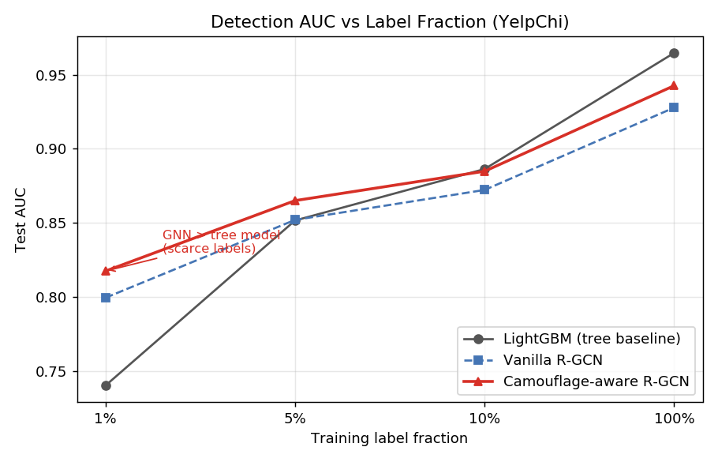

# camo-rgcn

**Camouflage-Aware Multi-Relation R-GCN for Graph Anti-Fraud** —
面向内容生态反作弊场景的多关系反伪装图神经网络，主打低标注下的稳健识别
与可解释的团伙挖掘。

核心是一种**标签无关的伪装边抑制**：用两端节点特征的余弦相似度做边权
`w = exp(β·(cos(x_u, x_v) − 1))`，给跨群体（疑似伪装）边乘上小权重再聚合。
配合 R-GCN 自带的每关系可学习权重 + 关系级 softmax 注意力，整套机制不依赖
任何标签信号，因此在 1% 标注的极低标注场景仍然有效——这是早一版用打分器
（监督训练）做边权时踩过的坑：低标注下打分器训不出来，反伪装机制随之失效。

## 主要结果

YelpChi（45,954 节点，3 关系），5 个随机种子，test AUC 均值 ± 标准差：

| 标注 | LightGBM | 标准 R-GCN | Camo R-GCN |
| ---: | ---: | ---: | ---: |
| 1%   | 0.7404 ± 0.026 | 0.7996 ± 0.018 | **0.8176 ± 0.019** |
| 5%   | 0.8517 ± 0.008 | 0.8521 ± 0.009 | **0.8651 ± 0.007** |
| 10%  | 0.8864 ± 0.005 | 0.8723 ± 0.008 | **0.8849 ± 0.006** |
| 100% | 0.9647 ± 0.001 | 0.9278 ± 0.003 | **0.9426 ± 0.003** |

> 标注越稀疏，图模型相对树模型越占优。

跨数据集对照（满标注，单设定）：

| 数据集 | LightGBM | 标准 R-GCN | Camo R-GCN | 备注 |
| --- | ---: | ---: | ---: | --- |
| YelpChi | 0.965 | 0.928 | 0.943 | 强协同（同商户/用户），图占优 |
| Amazon  | 0.951 | 0.937 | 0.939 | 特征已强 → 图增量有限 |

YelpChi 与 Amazon 的对照说明一个结论：图方法的价值取决于图结构里是否
承载了特征之外的判别信号；当特征已经足够强，图带来的边际收益很有限。



## 快速开始

```bash
pip install -r requirements.txt

# 1. YelpChi / Amazon: DGL 内置数据集，会自动下载
python src/baseline.py            # LightGBM 基线
python src/train_rgcn.py          # 标准 R-GCN
python src/train_camo_rgcn.py     # Camo R-GCN（主模型）
python src/multi_seed.py          # 5 种子 × 4 标注比例

# 2. 团伙挖掘 / 可解释性 / 处置闭环（依赖上面训出的主模型）
python src/detect_communities.py
python src/explain.py
python src/pipeline.py

# 3. LLM 归因（需要在 .env 配 ANTHROPIC_API_KEY / ANTHROPIC_BASE_URL）
python src/llm_attribution.py

# 可视化
python src/visualize.py
```

## 模型

主模型 `CamoRGCN`（`src/train_camo_rgcn.py`），约 2.9 万参数：

- 输入投影 `Linear(d_in → 64)`
- 2 层 `WeightedRelConv`：每关系一套无 bias `Linear(64 → 64)`，按节点特征余弦
  相似度边权做加权平均聚合，关系间用可学习 softmax 权重组合，残差 + ReLU + dropout
- `Linear(64 → 2)` 二分类头
- 加权交叉熵（按训练集类频率），Adam(lr=1e-2, wd=5e-4)，早停 patience=30

## 一些设计上的选择

- **边权为什么用余弦相似度**：早一版用打分器（监督训练）算边权，低标注下打分器
  自己就训不动；改成纯几何信号后，整个机制不再依赖标签。
- **关系组合权重为什么用 softmax 而不是直接相加**：直接相加学着学着会让某个关系
  的尺度跑掉，softmax 强制总权重为 1 更稳。
- **β 为什么固定**：试过给每关系一个可学习 β_r，多种子结果和固定 β=3 完全一致
  （±0.001）——`WeightedRelConv` 的 `rel_attn` 已经提供了关系级自适应，再加一层
  冗余。
- **LightGBM 早停的坑**：开 `scale_pos_weight` 后 `binary_logloss` 不再可比，
  早停必须 `metric="auc"` + `first_metric_only=True`，否则模型会被早停拉去优化
  一个跟实际表现脱钩的指标。

## 数据

YelpChi / Amazon：DGL `FraudYelpDataset` / `FraudAmazonDataset`，首次运行
自动下载到 `data/raw/`。

## 目录

```
src/                  代码
  config.py           路径与 .env 读取
  utils.py            指标（AUC / PR-AUC / KS / Recall@TopK）
  load_data.py        YelpChi / Amazon
  baseline.py         LightGBM
  train_rgcn.py       标准 R-GCN
  train_camo_rgcn.py  Camo R-GCN（主模型，含 WeightedRelConv）
  multi_seed.py       5 种子 × 4 标注比例
  detect_communities.py   Louvain 团伙挖掘
  explain.py          关系注意力 + 伪装边抑制 + 特征显著性
  llm_attribution.py  DeepSeek API 团伙归因
  pipeline.py         分级处置 + 监控
  visualize.py        三张主图
notebooks/01_eda.ipynb  数据探索
figures/                README 引用图
```

## License

MIT
